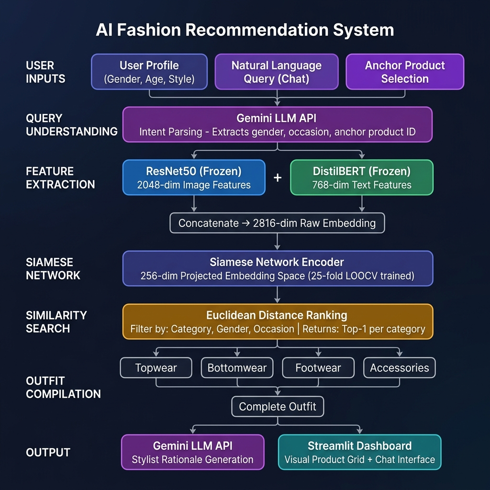

#  AI Fashion Outfit Recommendation System

> A hybrid multi-modal recommendation system built with PyTorch Siamese Networks, ResNet50, DistilBERT, and Gemini LLM — capable of understanding user intent, retrieving compatible outfit items, and explaining recommendations in natural language.



---

## 📌 Table of Contents
- [Project Overview](#project-overview)
- [System Architecture](#system-architecture)
- [ML Approach](#ml-approach)
- [Project Structure](#project-structure)
- [Setup & Installation](#setup--installation)
- [How to Run](#how-to-run)
- [Features](#features)
- [Dataset Analysis](#dataset-analysis)
- [Training Details](#training-details)
- [Evaluation](#evaluation)
- [Future Improvements](#future-improvements)

---

## Project Overview

This system provides end-to-end AI-powered fashion recommendations based on:
- **User profile** (gender, age, style preference, occasion)
- **Visual compatibility** of fashion items (via image embeddings)
- **Textual metadata** (product descriptions, tags, category)
- **Natural language queries** (conversational chat interface)

**Example interactions:**
| User Query | System Output |
|---|---|
| White formal shirt | Navy Chinos + Brown Loafers + Silver Watch |
| "I need an outfit for a business meeting" | Curated complete office outfit with stylist rationale |
| "Something stylish for a beach vacation" | Linen shirt + Shorts + Sandals + Sunglasses |

---

## System Architecture

```
User Input (Query / Profile / Anchor Product)
         │
         ▼
Gemini LLM ─── Intent Parsing (gender, occasion, anchor product ID)
         │
         ▼
┌─────────────────────────────────────────────┐
│           FEATURE EXTRACTION                │
│  ResNet50 (2048-dim)  +  DistilBERT (768-dim) │
│  ──────── Frozen Pre-trained Encoders ──────  │
│           Concat → 2816-dim embedding        │
└─────────────────────────────────────────────┘
         │
         ▼
Siamese Network Encoder
→ Projects 2816-dim → 256-dim compatibility space
→ Trained via Contrastive Loss (25-fold LOOCV)
         │
         ▼
Euclidean Distance Ranking
→ Filter: Category | Gender | Occasion
→ Returns top-1 per slot (Topwear, Bottomwear, Footwear, Accessories)
         │
         ▼
Complete Outfit (4-6 items)
         │
         ▼
Gemini LLM ─── Stylist Rationale (explains the exact recommended items)
         │
         ▼
Streamlit Dashboard (Visual Grid + Chat Interface)
```

See [`docs/ARCHITECTURE.md`](docs/ARCHITECTURE.md) for full component-level documentation.

---

## ML Approach

| Component | Technology | Purpose |
|---|---|---|
| Image Encoder | ResNet50 (pretrained, frozen) | 2048-dim visual feature extraction |
| Text Encoder | DistilBERT (pretrained, frozen) | 768-dim semantic feature extraction |
| Fusion | Concatenation → 2816-dim | Multi-modal embedding |
| Compatibility Model | Siamese Network (PyTorch) | Pairwise compatibility scoring |
| Training Strategy | 25-fold Leave-One-Out CV | Prevents overfitting on small dataset |
| Loss Function | Contrastive Loss | Pulls compatible pairs together |
| Similarity Search | Euclidean Distance | Nearest-neighbor retrieval |
| LLM | Gemini 2.5 Flash API | Query parsing + rationale generation |
| UI | Streamlit | Interactive web dashboard |

---

## Project Structure

```
AI-Fashion-Recommendation-System/
│
├── app.py                      # Streamlit web application (UI + chat interface)
├── data_loader.py              # Dataset loading + ResNet50/DistilBERT feature extraction
├── models.py                   # Siamese Network architecture (PyTorch)
├── train.py                    # Training pipeline with 25-fold LOOCV
├── recommendation_engine.py    # Outfit compilation + similarity search engine
├── visualize.py                # Loss curves, t-SNE embedding visualizations
│
├── products.csv                # 68 product metadata records
├── outfits.csv                 # 25 ground-truth expert-curated outfits
├── images/                     # Product image files (Ajio, Myntra, Nykaa)
│   ├── ajio/
│   ├── myntra/
│   └── nykaa/
│
├── best_model.pth              # Trained Siamese Network weights
├── raw_embeddings.pkl          # Pre-computed 2816-dim product embeddings
│
├── requirements.txt            # Python dependencies
├── .streamlit/
│   └── config.toml             # Streamlit dark theme config
│
└── docs/
    ├── ARCHITECTURE.md         # Detailed component architecture documentation
    ├── DATASET_ANALYSIS.md     # Dataset structure, stats, and challenges
    ├── architecture_diagram.png# System architecture diagram
    ├── loss_curves.png         # Training/validation loss visualization
    └── tsne_embeddings.png     # t-SNE embedding cluster visualization
```


---

## Setup & Installation

### Prerequisites
- Python 3.9+
- pip

### Step 1: Clone the Repository
```bash
git clone https://github.com/YOUR_USERNAME/ML-TASK.git
cd ML-TASK
```

### Step 2: Install Dependencies
```bash
pip install -r requirements.txt
```

> **Note**: PyTorch with CUDA is recommended for faster feature extraction. The system will fall back to CPU automatically.

### Step 3: (Optional) Set Gemini API Key
For live LLM-powered intent parsing and stylist rationale generation:
```bash
# Windows (PowerShell)
$env:GEMINI_API_KEY="your-gemini-api-key-here"

# Linux / macOS
export GEMINI_API_KEY="your-gemini-api-key-here"
```
Get a free API key at: https://aistudio.google.com/

---

## How to Run

### Step 1: Extract Embeddings & Train the Model
```bash
python train.py
```
This will:
1. Load all 68 product images and metadata
2. Extract ResNet50 + DistilBERT features → save `raw_embeddings.pkl`
3. Generate compatible/incompatible training pairs from 25 outfits
4. Train a Siamese Network with 25-fold LOOCV → save `best_model.pth`
5. Plot training curves → save `loss_curves.png`

> ⏱️ Expected time: ~5–15 min (CPU) | ~2–5 min (GPU)

### Step 2: Generate Visualizations
```bash
python visualize.py
```
Generates `tsne_embeddings.png` showing how the learned embedding space clusters compatible items.

### Step 3: Launch the Web App
```bash
python -m streamlit run app.py
```
Open your browser at: **http://localhost:8501**

---

## Features

### 🎯 Outfit Builder (Tab 1)
- Select any anchor product (filtered by gender preference)
- Click **"Generate Compatible Outfit"**
- AI recommends Topwear + Bottomwear + Footwear + Accessories
- Stylist commentary explains the color coordination and occasion suitability

### 💬 Conversational Assistant (Tab 2)
- Type natural language requests (e.g., *"I need a formal look for a wedding"*)
- Gemini LLM parses the intent → Siamese Network retrieves compatible items
- Visual outfit grid + professional stylist rationale generated

### 🧠 Explainability
- Every recommendation includes detailed reasoning explaining:
  - Color palette harmony
  - Occasion suitability
  - Stylistic cohesion of the complete outfit

---

## Dataset Analysis

See [`docs/DATASET_ANALYSIS.md`](docs/DATASET_ANALYSIS.md) for full analysis.

**Quick Summary:**
- **68 products** across 47 unique subcategories
- **25 expert-curated outfits** (ground truth compatibility data)
- Sourced from: Ajio, Myntra, Nykaa
- Categories: Topwear, Bottomwear, Footwear, Accessories, One-Piece/Sets, Layering
- Genders: Men (34), Women (34)
- Occasions: Office, Wedding, Party, Casual, Festive, Sports, Vacation

---

## Training Details

| Parameter | Value |
|---|---|
| Model | Siamese Network |
| Input Dim | 2816 (ResNet50 2048 + DistilBERT 768) |
| Embedding Dim | 256 |
| Training Strategy | 25-fold Leave-One-Out Cross-Validation |
| Loss | Contrastive Loss (margin=1.0) |
| Optimizer | Adam (lr=1e-3) |
| Epochs per fold | 30 |
| Batch Size | 16 |
| Regularization | Dropout (0.3), Weight Decay (1e-4) |

---

## Evaluation

- **Approach**: 25-fold LOOCV — each fold holds out one outfit as test set
- The model with the lowest validation loss is saved as `best_model.pth`
- Visual evaluation via t-SNE: compatible items cluster together in embedding space

See `docs/loss_curves.png` and `docs/tsne_embeddings.png` for visual evidence.

---

## Future Improvements

1. **FAISS/Qdrant Vector DB** — Replace brute-force Euclidean search with ANN index for scalability
2. **FashionCLIP / CLIP** — Replace ResNet50+DistilBERT with a fashion-specific CLIP model for better multimodal alignment
3. **Graph-based Recommendations** — Model outfit compatibility as a knowledge graph (items = nodes, compatibility = edges)
4. **User Feedback Loop** — Incorporate thumbs up/down signals to continuously improve compatibility scores
5. **Larger Dataset** — Scale to Myntra/Ajio full catalog (millions of items) with proper sampling

---

*Developed for the Dare XAI ML & AI Engineer Intern Assignment.*
